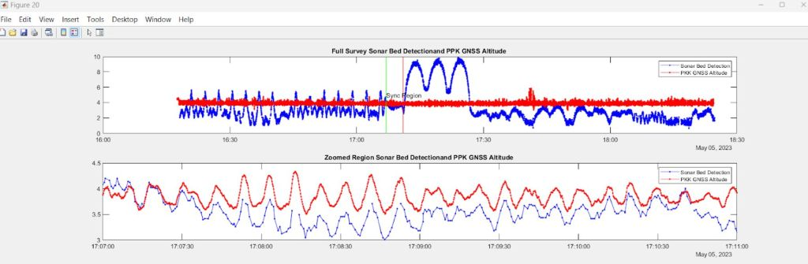
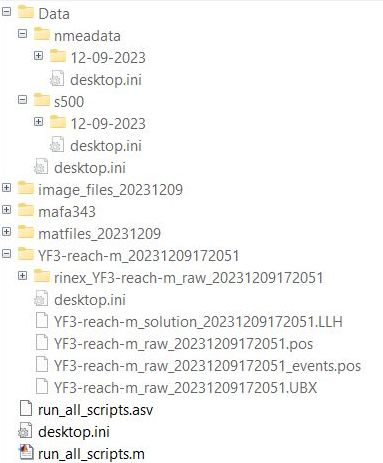
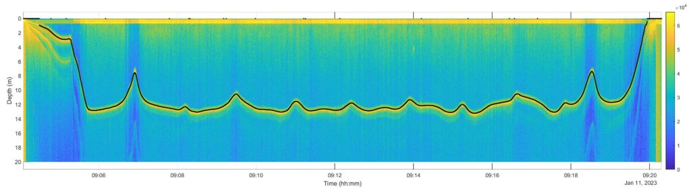

## MATLAB® Data Processing Scripts and Output Files

Processing as described in this section has been designed to allow maximum flexibility, giving the user the ability to change discrete parameters. We have found this provides the best resulting data when surveying in challenging surf-zone conditions. If operating in less challenging environments, and if a user does not have experience with or access to current Matlab libraries, both trackline and mapping data can be generated by non-Matlab users with a series of pre-compiled apps running in a freely available Matlab run-time environment. The pre-compiled executables are under development, posted to the ICS GitHub as they are tested and released. The trackline data can be further edited to generate maps in a variety of third-party software, or the map generated by ICS software can be used. The compiled executables have the same ability to adjust setting as the Matlab script through a Input Parameter file (InputParam.txt), however the Matlab Scripts can be edited by advanced users while the executables cannot. Contact ICS for details.

The post-processing of Yellowfin S500 sonar and GNSS data is a multistep process. Matlab scripts are available at the ICS github at the following link:

https://github.com/developer-ics/s500_DataAcq_PostProcessing/tree/main/ProcessingScripts_Alpha

The compiled executables are located in:

[https://github.com/developer-ics/s500_DataAcq_PostProcessing/tree/main/ProcessingScripts_Alpha/MatlabRuntimeCompiledExes/YellowFin_Processing](https://github.com/developer-ics/s500_DataAcq_PostProcessing/tree/main/ProcessingScripts_Latest_Stable/MatlabRuntimeCompiledExes/YellowFin_Processing)

The run time environment can be installed using:

[https://github.com/developer-ics/s500_DataAcq_PostProcessing/blob/main/ProcessingScripts_Alpha/MatlabRuntimeCompiledExes/YellowFin_Processing/for_redistribution/MyAppInstaller_web.exe](https://github.com/developer-ics/s500_DataAcq_PostProcessing/blob/main/ProcessingScripts_Latest_Stable/MatlabRuntimeCompiledExes/YellowFin_Processing/for_redistribution/MyAppInstaller_web.exe)

and then processing script is run using:

[https://github.com/developer-ics/s500_DataAcq_PostProcessing/blob/main/ProcessingScripts_Alpha/MatlabRuntimeCompiledExes/YellowFin_Processing/for_redistribution_files_only/YellowFin_Processing.exe](https://github.com/developer-ics/s500_DataAcq_PostProcessing/blob/main/ProcessingScripts_Latest_Stable/MatlabRuntimeCompiledExes/YellowFin_Processing/for_redistribution_files_only/YellowFin_Processing.exe)

During processing a number of sequentially numbered plots are auto-generated in Matlab, labeled as Figure \<nn\>. A typical output is shown in Figure 1, below.

|                  |
|-----------------------------------------------------------------|
| Figure 1. Sample PPK GNSS Altitude and Sonar Bed Elevation data |

Individual scrips are available for each step of the process and a master script (run_all_scripts.m) that calls the scripts for each step is also provided. run_all_scripts.m is documented to describe each step of the processing.. It is located in the SampleData folders on github at the following link: <https://github.com/developer-ics/s500_DataAcq_PostProcessing/tree/main/SampleData>

Two sample datasets are available:

MVLPData is from the south coast of Martha’s Vineyard with substantial heave and wave breaking.

<https://github.com/developer-ics/s500_DataAcq_PostProcessing/tree/main/SampleData/MVLPData>

A InputParam.txt file for this data set is located in [https://github.com/developer-ics/s500_DataAcq_PostProcessing/blob/main/ProcessingScripts_Alpha/MatlabRuntimeCompiledExes/YellowFin_Processing/for_redistribution_files_only/YellowFin_Processing.exe](https://github.com/developer-ics/s500_DataAcq_PostProcessing/blob/main/ProcessingScripts_Latest_Stable/MatlabRuntimeCompiledExes/YellowFin_Processing/for_redistribution_files_only/YellowFin_Processing.exe)

Thus running YellowFin_Processing,exe and answering y at the 1st prompt will process this sample data. The path to the sample data in the InputParam.txt file will need to be edited from

data_dir,string,F:\\GDriveICS\\My Drive\\IntegratedCoastalSolutions\\SoftwareDevelopment\\Yellowfin\\ExampleDataPro\\MVLPData

to a location where the data set has been downloaded.

PondTest2 was acquired during flat water testing

<https://github.com/developer-ics/s500_DataAcq_PostProcessing/tree/main/SampleData/PondTest2>

The data files can be downloaded from the Raspberry Pi logger on Yellowfin via WinSCP or similar SCP/SSH software. **Note:** the directory stucture shown in Figure 2 below **must** be maintained on the analysis PC. The GNSS data directory (YF3-reach-m_2023\* in this case) should also contain the results of the Emlid Studio PPK processing of the GNSS data.

Figure 2. – Required Directory Structure - Analysis PC

The master script that calls each step (run_all_scripts.m ) reads an input parameter file - by default InputParam.txt. Alternately the user may specify different Input file names and paths when prompted or in the InputParam.txt file.

All parameters have the format:

parameter name, comment (units), parameter value.

The 1st parameter in the input file is:

survey_day,(year/month/day),2024/02/06.

The 2nd variable is the path to the processing scripts, which can be changed as desired, eg:

data_dir,string,F:\\GDriveICS\\My Drive\\Yellowfin\\pondtest_2_6_2024

Each step can be enabled or disabled by setting the enable variable to 0 (disable) or 1 (enable), eg:

enable_S1 - enables step 1- read NMEA GPS data,0

Output files will be created in:

odir=[data_dir '\\matfiles_' fs2 '\\'];% location of matfiles that are stored in processing, where fs2 is a date string

godir=[data_dir '\\image_files_' fs2 '\\'];% location of graphics files that are generated in processing.

Note that each step of the processing saves data for the next step. So once a time-consuming step such as reading the S500 data (Step 2) has been completed it can be disabled as described above.

Additional functions required for processing with the Matlab scripts are located in ExtraMfiles

<https://github.com/developer-ics/s500_DataAcq_PostProcessing/tree/main/ProcessingScripts/ExtraMfiles>

as well as the Matlab topotoolbox which is required for mapped output.

<https://www.mathworks.com/matlabcentral/fileexchange/50124-topotoolbox>

### NMEA Processing (Step 1)

The MATLAB script s1_readNMEAfiles.m reads NMEA GNSS data written to the Raspberry Pi datalogger, and will produce the file s1_NMEA_GNSS_DATA_YYYYMMdd.mat in the matfiles directory.

### Sonar Processing (Step 2)

The MATLAB script s2_read_s500sonar.m reads Cerulean S500 sonar data downloaded from the Raspberry Pi datalogger, and will produce the file

s2_s500_DETECTED_RANGE\_ YYYYMMdd.mat in the matfiles directory.

Parameters for this step are:

echo_profile,boolean - enables processing of echo intensity,0  
**Note that if the maximum range (length_mm)\_ as set on the USV (sonar_param.csv) is changed during the survey echo_profile,1 will not work and this parameter must set to 0. To process data where length_mm is changed during the survey the data must be divided into two folders an processed each folder must be processed separately.**

system_default_sound_speed,m/s (set in sonar and usually not changed),1500

measured_sound_speed,m/s,1426

use_txt_depth_string,1 for older s500 firmware - 0 otherwise,0

The echo_profile (echo_profile,boolean - enables processing of echo intensity,1) processing can be used if the real time bed detection on the sonar fails . this will produce an output file s2_profile_data_yyyymmdd.mat

This resulting file contains the detected depth (calculated internally by the S500 sonar) along with the following variables:

-   Time_stamps (dt_txt)
-   Depths (txt_depth)
-   Smoothed depth output (txt_smooth_depth) in units of m.
-   Depth confidence estimates ('ping_conf' and 'smooth_ping_conf')

The smoothed depth is delayed by 10 samples (2.7 seconds with 20 m range) due to the internal realtime casual filtering. In post-processing, non-causal forward and reverse smoothing with no time delays is possible.

In addition to the detected depth, the output of the full intensity profile for each ping from ID = 1308 data packets is written to the MATLAB file

s2_profile_data\_ YYYYMMdd.mat. It contains the following variables:

-   dt_profile - timestamps for each ping
-   range_bins - a vector of range bins for each intensity value
-   profile_int_matrix - the matrix of intensity values whose size is defined by the number of timestamps by the number of range bins.
-   bed_detect_range - the depth value for each ping determined by a threshold detector in the MATLAB script. This detector could be modified to account for the presence of bubbles or other scatterers.

An example of the profile output is shown in Figure 3 below. Computational detection of the bed is available in this Alpha release. See step 3. Manual editing of the detected depth guided by the full intensity profile is under development (9/15/2024).

Figure 3– Typical Full Intensity Profile Plot (ID=1308)

### s3_Intensity_profile_bed_detection (Step 3)

The script s3_Intensity_profile_bed_detection calculates the bed location from the intensity profiles generated in step 2. This requires echo_profile set to 1. There are several important parameters in this script that are not yet exposed in the InputParam.txt file but will be soon. Some of these are

blank_r=.4;

max_r=1.8;

int_prct_thresh_val=93;

clean_filt_length=13;

### Setting Start & End Times (Step 4)

The script s4_Set_start_end_time_sync sets the start and end times for processing based on when the GPS height drops below some height and rises above a height defined by GPS_thresh,elevation. This defines the threshold for determining start and end time (m). A value of 1 or 2 is typical of coastal surveys as the vehicle drops below 1 m (MSL) before launch.

Use_Realtime_Bed_Detection, Uses s500 built in realtime bed detection. set to 0 to use Intensity_profile_bed_detection results from step 3,0

A second check is performed based on running a standard filter on the detected bed return with a threshold defined by SONAR_thres. This is the Sonar bed detection threshold for determining start and end time (in m) – typically set to 2

The shorter of these two time spans is used for subsequent processing steps. If required, additional delay can be specified by the variable sonar_start_time_adjust and sonar_end_time_adjust. This script also writes the GPS time stamps to the sonar data by using the datalogger time stamps that are acquired with the GNSS and sonar data, eliminating the effects of realtime clock synchronization errors on the datalogger.

Exclusion periods can be assigned for periods when data was known to be bad. Eg USV was taken out of the water.There can be as many exclusion periods as desired:

exclusion_start_time_1,year/month/day hh:mm:ss, 2024/02/09 16:16:20

exclusion_end_time_1,year/month/day hh:mm:ss, 2024/02/09 16:20:31

exclusion_start_time_2,year/month/day hh:mm:ss, 2024/02/09 16:32:20

exclusion_end_time_2,year/month/day hh:mm:ss, 2024/02/09 16:37:15

### Combining NMEA & Sonar Data (Step 5)

The script s5_MergeNMEA_GPS_s500 combines the NMEA and sonar data. Two rounds of data filtering using median filters are performed. These can be enabled or disabled by despike_on, enables time series despking based on median filters,1

This script produces a scatterplot with dots colored by depth as a function of latitude (lat) and longitude (lon) and a contour map of the depth if the variable make_maps is set to 1.

A final outlier rejection step can be performed by comparing the trackline data to a spatial smoothed surface output, and rejecting values that are greater than spatial_reject_thr (m) from the surface. This requires lines that are close enough to enable accurate interpolation and requires spatial_filter_rejection =1 and make_maps =1.

These steps will remove short periods (less than a few seconds) of bad data (outliers). An exclusion period should be set for longer periods of low quality data.

The depth ouptut in this step is relative to the ASV altitude (i.e. - not a Geodetic datum) and is not corrected for heave. To correct for heave the PPK post-processed GNSS data is required.

### Emlid File Conversion (Step 6)

The script s6_read_emlid_LLH_PPK reads the Emlid Reach files that are created in the Emlid Studio post processing software and converts the data from these files to MATLAB format files for merging with sonar data. **Note** - both \*.LLH and \*.pos files are required and should be left in the uncompressed folders created by the Emlid software. A conversion from ellipsoidal height to orthometric height can be defined by the variable ell2ortho.

### Merging Data (Step 7)

The script s7_MergePPKGPS_sonar merges the PPK GNSS data saved in

s6_read_emlid_LLH_PPK with the sonar data to create output products that are heave compensated and correctly referenced to the datum of the PPK GNSS data.

There is an important step in this processing script that looks for any temporal synchronization errors by correlating heave signals from echosounder data and PPK GNSS data. This methodology has been tested extensively with the S500 sonar and Emlid Reach GNSS systems. In most cases, the synchronization performed in Section 9.4.4 is usually sufficient and this step is not needed.

To perform this step, the variable use_resync must be set to 1 and a section of data with large heave variations and flat bottom topography must be selected. Figure 20 and the variables start_sync_time and end_sync_time can be used to select the correlation period. The output of the correlation function in the 2nd panel of Figure 21 should have a peak at zero.

Final trackline data with PPK heave corrected output is produced in the ascii file

PPK_Heave_Corrected_Trackline_Data_YYYYMMdd.txt. This file contains the variables:

longitude

latitude

-   z_seafloor_datum - elevation of seafloor relative to datum (m, - down)
-   z_water_surf_gps_datum - elevation of water surface relative to datum (m)
-   z_gps_datum - elevation of GNSS antenna relative to datum (m)

Mapping output is enabled by setting the variable make_maps_ppk to 1.
